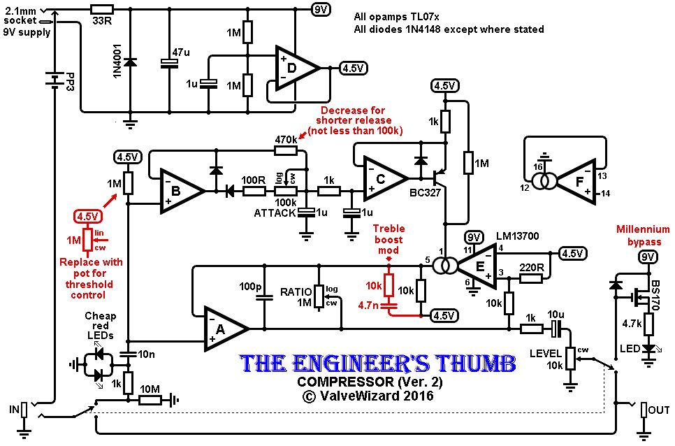
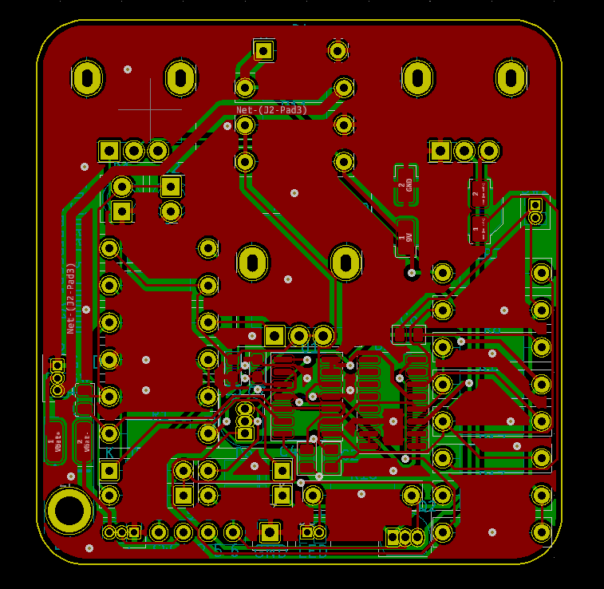
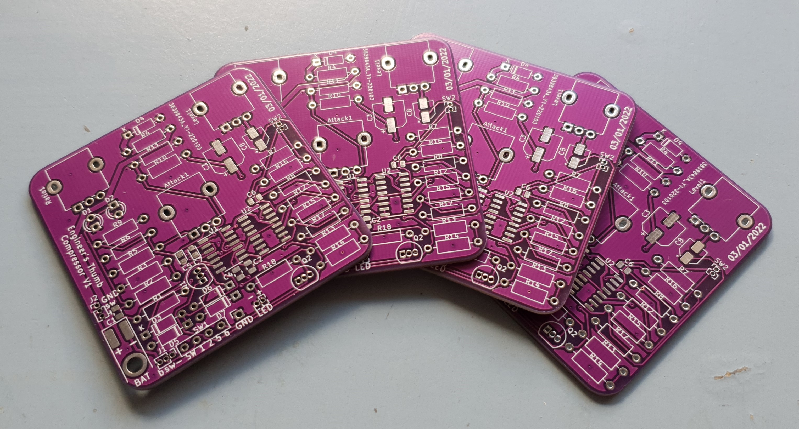
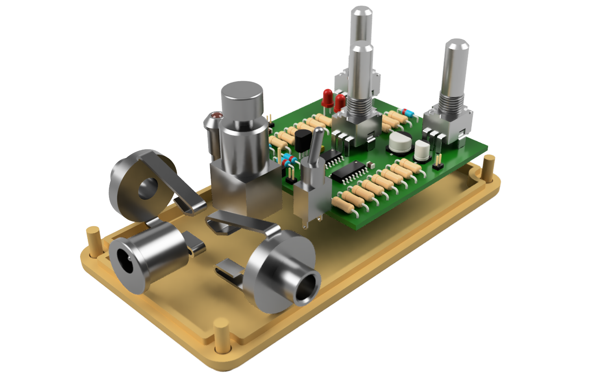

# Electric guitar compressor pedal

## 1 - Overview / motivation

For a long time I have wanted to build my own electric guitar pedal. The concept of audio compression always appealed to me both in terms of how audio compression circuits operate as well as an audio effect to use with my guitar. Audio compressors are devices which reduce the volume of a signal when a loud sound spike occurs while leaving the signal unaffected the rest of the time (basically). This has the effect of reducing the dynamic range of a signal, which means that the difference in volume between the loudest and quietest signals is reduced.

While searching through articles about different compression circuits, I stumbled across an <a href="http://www.valvewizard.co.uk/engineersthumb2.html" target="_blank">article by The Valve Wizard</a> which features a compression circuit called the engineers thumb. This circuit has several advantages compared to other common compressors including the option for all five controls commonly found in an audio compressor circuits: attack, release, threshold, ratio (although I only used three of these).

The goal for the project was to take this design and package it into a custom, drilled enclosure with all of the necessary switches, knobs and jacks. I also designed a custom PCB derived from the original circuit (more details later).

<figure>
        
        <figcaption>
            Figure 1.1 - Inside and outside of the pedal
    </figcaption>
</figure>
## 2 - Circuit overview and PCB  design

The <a href="http://www.valvewizard.co.uk/engineersthumb2.html" target="_blank">article</a> written by The Valve Wizard has has a good description on the operation of the circuit, I will provide provide an explanation here as well. The original schematic from the <a href="http://www.valvewizard.co.uk/engineersthumb2.html" target="_blank">valve wizards website</a> is shown in figure 2.1. The signal from the guitar is fed via a DC blocking capacitor into the non-inverting input of opamp A. Within the feedback loop of this opamp circuit, there is an operational transconductance amplifier or OTA for short. The part chosen for this purpose was the LM13700 and essentially acts as a current controlled resister. And a resistor in the feedback loop of an opamp circuit sets the gain. This means that this part of the circuit is a current controlled amplifier, whereby changing the current flowing into the OTA (E) changes its resistance which modulates the gain of the opamp circuit it is placed within.

<figure>
        
        <figcaption>
            Figure 2.1 - Original schematic by The Valve Wizard
    </figcaption>
</figure>
There is another circuit operating on a separate branch consisting of opamps B and C. This circuit measures the amplitude of the input signal by rectifying the signal and storing the charge in two 1uF capacitors. This circuit generates a precision current source based on the voltage stored in those capacitors. This current, which is generated by opamp C and a PNP transistor, is proportional to the magnitude of voltage on the input. This current source is fed to the OTA (E) thereby adjusting the gain of the opamp A circuit. After passing through a volume potentiometer and a DC blocking capacitor, the output of opamp A is fed to the output.

As a point of interest, OTA's tend to produce a relatively large amount of noise. Because the OTA is inside the feedback loop of the opamp A circuit, the opamp circuits gain is inverse to the gain of the OTA. This is because with negative feedback, if what is being fed back to the inverting terminal of opamp A is increased (OTA running at higher gain) then the output of the opamp circuit will decrease. This has the effect of reducing the noise of the circuit when the circuit is running at maximum gain (idle).

## 3 - Packaging and construction

The first task to complete was the design of the PCB. Using KiCad I re-drew the circuit schematic based on the original circuit in Figure 2.1. After that I chose all of the footprints for the components opting for mostly through hole parts. The choice to use through hole parts is mostly due to the ease of PCB assembly and circuit debugging. A spreadsheet with links to purchase locations for all parts, along with their associated part quantities, footprints and prices was made. After that the PCB was routed using KiCad, shown in figure 3.1.

<figure>
        
        <figcaption>
            Figure 3.1 - PCB design in KiCad
    </figcaption>
</figure>
The footprints for the three potentiometers which control attack, ratio, and level were positioned precisely to line up with the holes on the case. The majority of the effort in designing the PCB was in how to interface with externally mounted components. Every externally mounted electrical component needed its own footprint on the PCB, then needed to be wired and mounted mechanically. Opting to mount components directly to the PCB would save a lot of time during the construction phase. Figure 3.2 shows the PCB's that I got manufactured at JLC PCB. I chose purple because green PCB's are boring.

<figure>
        
        <figcaption>
            Figure 3.2 - PCB's manufactured by JLC PCB
    </figcaption>
</figure>
The hardware that I used for this project was from <a href="https://www.taydaelectronics.com/" target="_blank">Tayda Electronics</a>. They sell a variety of enclosures that are fit for housing guitar effects projects. Their website also allows you to send dimensions for them to pre-drill holes in the enclosure for all of the off-board components (switches, jacks, on LED) before painting and shipping it to you. Very convenient.

<figure>
        
        <figcaption>
            Figure 3.3 - Render of whole assembly without lid
    </figcaption>
</figure>
All of the packaging of the different components was designed in CAD. Figure 3.3 shows a render of the design.

## Conclusion

I hadn't played an electric guitar through a compressor pedal before, so I wasn't sure what to expect. I Found the most use out of this pedal for cases where I was changing between solo / single note playing and rhythm / strumming. The loudness of the strumming was brought down to a similar volume level of the solo playing while not putting in a lot of effort to control dynamics. I tend to set the attack knob to fast or fastest as it is a strange sound when an effect is engaged slightly after a sound occurs.

The other use was as a limiter. Placing the compressor with the compression knob turned all the way up right before an overdrive pedal meant notes would keep ringing out at full distortion for long periods of time. A cool effect, and a lot of fun.

Doing this project again, the only thing I would change would be to move more components onto the PCB to save time wiring and mounting. Aside from that this is definitely a pedal I will continue to use and would recommend anyone build up themselves.
