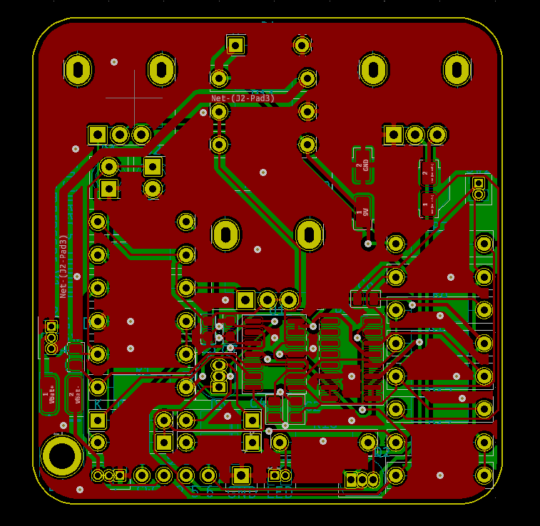

# Electric guitar compressor pedal

## 1 - Overview / motivation

-  (E.g. wanted to improve PCB design and part sourcing with)

- Logistics of ordering parts for a project (BOM management)

For a long time I have wanted to build my own electric guitar pedal. The concept of audio compression always appealed to me both in terms of how audio compression circuits operate as well as an audio effect to use with my guitar. Audio compressors are devices which reduce the volume of a signal when a loud sound spike occurs while leaving the signal unaffected the rest of the time (basically). This has the effect of reducing the dynamic range of a signal, which means that the difference in volume between the loudest and quietest signals is reduced.

While sifting  through articles about different compression circuits I stumbled across an <a href="http://www.valvewizard.co.uk/engineersthumb2.html" target="_blank">article by The Valve Wizard</a> which features a compression circuit called the engineers thumb which has several advantages compared to more common designs. The design includes options for all five of the controls commonly found in an audio compressor circuits, not least of which includes the option for all five controls. Attack, release, threshold, ratio, and level.

The goal for the project was to take this design and package it into a custom drilled enclosure with all the necessary switches, knobs and jacks. I also designed a custom PCB derived from the original circuit (more details later).

<figure>
        
        <figcaption>
            Figure 1.1 - Inside and outside of the pedal
    </figcaption>
</figure>

## 2 - Circuit overview and PCB  design

The <a href="http://www.valvewizard.co.uk/engineersthumb2.html" target="_blank">article</a> written by The Valve Wizard has has a good description on the operation of the circuit, I will provide provide an explanation here as well. The orignal schematic from the <a href="http://www.valvewizard.co.uk/engineersthumb2.html" target="_blank">valve wizards website</a> is shown in figure 2.1. The signal from the guitar is fed into opamp A (operational amplifier) set up with negative feed back. Within the feedback loop of this opamp circuit, there is an operational transconductance amplifier or OTA for short. This device essentially acts as a current controlled resister. And a resistor in the feedback loop of an opamp circuit sets the circuits gain. This means that this part of the circuit is a current controlled amplifier, whereby changing the current flowing into the OTA (E) changes its resistance which reduces the gain of the opamp circuit it is placed within.

There is another circuit operating on a separate branch consisting of opamp B and C which measures the amplitude of the input signal. This circuit generates a current source whose amplitude is in proportion to the magnitude (voltage) of the signal input on the non-inverting terminal of opamp B. This current source is fed to the OTA (E) thereby adjusting the gain of the opamp A circuit. After passing through a volume potentiometer and a DC blocking capacitor, the output of this opamp A is fed to the output.

OTA's tend to produce a relatively large amount of noise. One of claimed advantages of this circuit over other designs is that because the OTA is in the feedback loop of the opamp A circuit, the opamp circuits gain is inverse to the gain of the OTA. This is because with negative feedback , if what is being fed back to the inverting terminal of opamp A is increased (OTA running at higher gain) then the output of the opamp circuit will decrease.

Thus has the advantage that

 when at idle (opamp  A circuit is at highest gain) while no signal is being sent to the pedal, the OTA will be functioning at its lowest and because OTA's produce a lot of noise the overall noise of the circuit will be lower with this configuration.

<figure>
        
        <figcaption>
            Figure 2.1 - Original schematic by The Valve Wizard
    </figcaption>
</figure>

## 3 - Packaging and construction

Stages of design:

- PCB design
- Enclosure layout
- Enclosure

The first task to complete was the design of the PCB. Using KiCad I re-drew the circuit schematic based on the original circuit in Figure 2.1. After that I chose all of the footprints for the components opting for mostly through hole parts. The choice to use through hole parts is mostly due to the ease of PCB assembly and circuit debugging. A spreadsheet displaying links to purchase locations for all parts, along with their associated part quantities, footprints and prices was made.

<figure>
        
        <figcaption>
            Figure 3.1 - PCB design in KiCad
    </figcaption>
</figure>

After that the PCB was routed using KiCad. The footprints for the three potentiometers which control attack, ratio, and level were positioned precisely to line up with the holes on the case. The majority of the effort in designing the PCB was in how to interface with externally mounted components, switches, jacks, and LED's. For each of these components there needs to be a solder pad or header pin connection, then soldering wires between these pads to the correct pins on each component. In future I will limit how many components that I mount off-board to reduce the time that is required to make connections to externally mounted components.

<figure>
        
        <figcaption>
            Figure 3.2 - PCB's manufactured by JLC PCB
    </figcaption>
</figure>

The hardware that I used for this project was from <a href="https://www.taydaelectronics.com/" target="_blank">Tayda Electronics</a>. They sell a variety of enclosures that are fit for housing guitar effects projects. Their website also allows you to send dimensions for them to pre-drill holes in the enclosure for all of the off-board components (switches, jacks, on LED) before painting and shipping it to you. Very convenient.

<figure>
        
        <figcaption>
            Figure 3.3 - Render of whole assembly without lid
    </figcaption>
</figure>

## Conclusion (things  learnt, possible changes) and sound clip?

The hardest part of the design process seems to be interfacing between the PCB and external components. 
