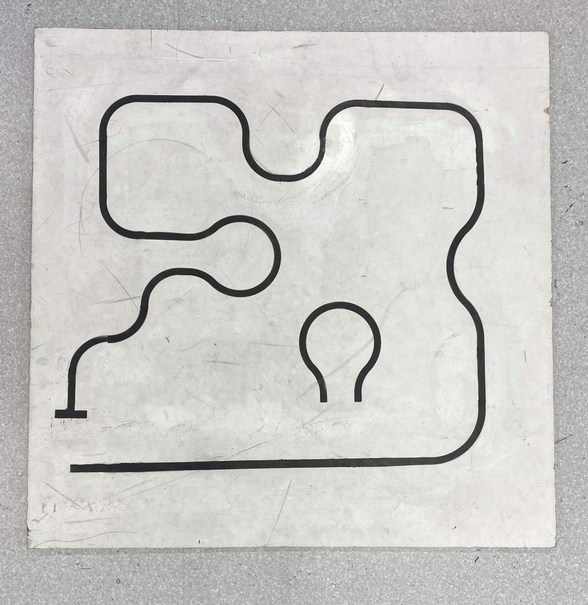
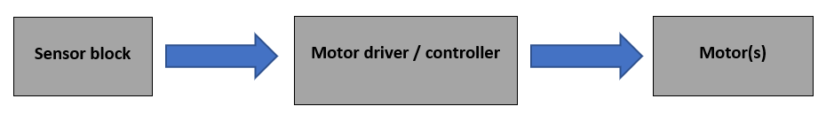
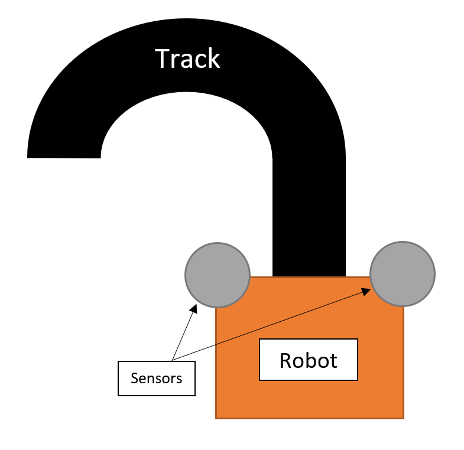
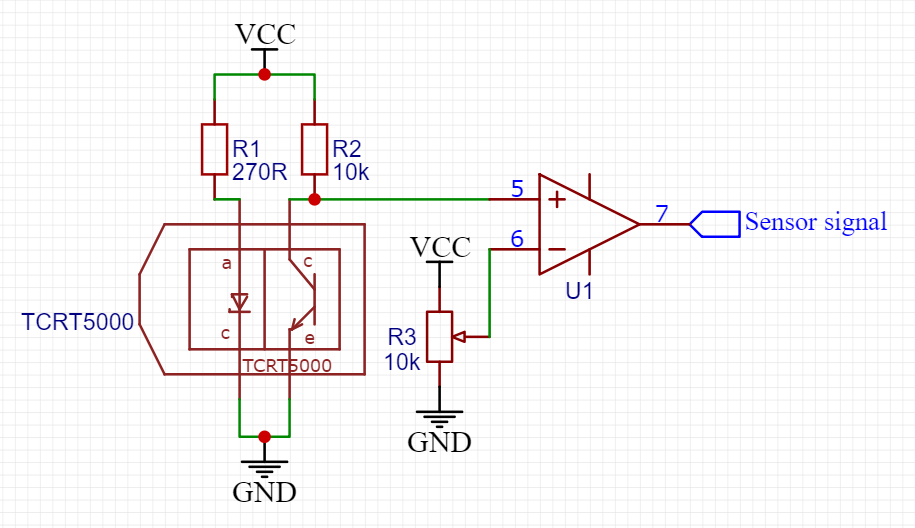
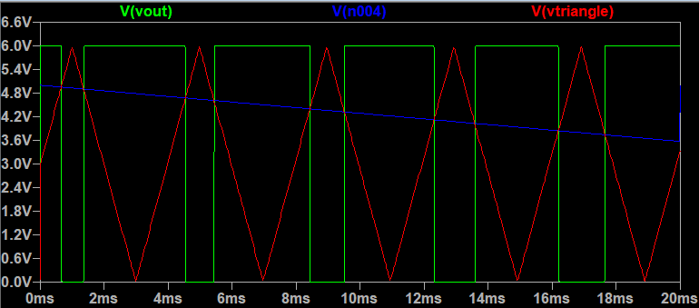

# Line Following Robot

<figure>
    
    <figcaption>
            Line-following robot - Race day
    </figcaption></figure>

## 1 - Abstract

This project required groups to construct a line following robot using basic electrical components. Everything from the chassis, wheels, circuit design and gearboxes was designed to complete the project. The robots would be raced around a simple course and raced in a time trial format. Our design utilised operational amplifiers to control the motors, we were the only group whose robot able to complete the course using operation amplifiers. We used a r

ubberband pully system to reduce the speed of the motors. And managed to complete the course in a time of 1:44.

## 2 - Introduction

The objective of this project was to design and construct a line following robot. A black line with a white background as shown in Figure 2.1 acted as a track to race the robots on. The course had many corners to which the robot would need to follow closely. The course was less than five meters in length. The project would require the careful integration of electrical circuitry and mechanical design to yield a functional robot that would follow the course quickly and accurately.

<figure>
        
        <figcaption>
            Figure 2.1 - Track used to race to race the robots on
    </figcaption>
</figure>

### 2.1 - Motors and electrical components

Two 6V DC motors were provided to allow the robot to move. The design had to be powered by four or less AA alkaline batteries. An electrical circuit was designed to provide the control for the two motors. These circuits were then manufactured as printed circuit boards (PCB) onto which the electrical components could be connected. A maximum of five TCRT5000 infrared light sensors which can be used to detect the black course line were allowed to be used in the design.

### 2.2 - Mechanical components

A chassis, wheels and other mechanical components for the robot were designed and constructed using a combination of 3D printing and laser-cut acrylic as well as basic 3mm nuts, bolts, and washers. Rubber bands for use in pully systems or to act as tires were also allowed.

### 2.3 - Design approaches

A method for steering the robot would need to be implemented which requires some form of computation. Groups were given the choice to base their circuits on operational amplifiers (opamps) or a micro-controller. The use of a micro-controller may reduce the complexity of some parts of the circuit, while the logic for steering and motor control would needed to be coded in software. This has the advantage that more complex, multi sensor designs could be constructed with minimal increases to circuit complexity. An op-amp based design has the advantage of simplicity, with no need for programming.

<figure>
        
        <figcaption>
            Figure 3.1 - System control logic
    </figcaption>
</figure>

Two sensors placed at the front of the robot on either side are used to measure the position of robot relative to the black line as shown in Figure 3.2. Initially both motors run at maximum speed. If either of the sensors detect that they are over the line (as is the case when the robot encounters a bend in the track), then the motor on the same side as the sensor will slow or stop completely. By slowing or stopping a motor on the left or right side of the robot (known as differential steering), the robot will steer in that direction.

<figure>
        
        <figcaption>
            Figure 3.2 - Sensor positioning relative to line course
    </figcaption>
</figure>

### 3.2 - Circuit design

From a high level, the circuit design can be summarised by several blocks as illustrated previously in Figure 3.1. The sensor block is based around a TCRT5000 reflective optical sensor. It produces infrared light while measuring how much of that light is reflected. Different amounts of light are reflected for black and white surfaces. Using this, the robot can distinguish between points on and off the black line. A comparator is fed a voltage from the sensor and a voltage from a reference voltage set with a potentiometer (R3) as shown in figure 3.3. The output of this comparator is either 0V or VCC, this signal is fed to the motor controller block.

<figure>
        
        <figcaption>
            Figure 3.3 - Sensor circuit
    </figcaption>
</figure>

### 3.2.1 - Motor control

The job of the motor controller is to regulate how much power is sent to the motors. Figure 3.4 shows the circuit designed to carry out this function. It takes the digital signal from the sensor module comparator and feeds it into a mosfet. When this mosfet is switched on it charges capacitor C1 up to the voltage of VCC (~6V). The voltage stored by capacitor C1 determines the speed at which the motor will run. A higher voltage results in a higher motor speed.

<figure>
        
        <figcaption>
            Figure 3.4 - Motor driver / PWM generator circuit
    </figcaption>
</figure>

At the moment when the sensor detects the black line, the digital signal from the sensor module will go to zero volts, and the mosfet will stop charging the capacitor (C1). The capacitor will then discharge through R1 and R2. This discharge will decay exponentially according to the function shown in equation 1.
$$
V_c = VCC * e^{\frac{t}{C_1R_1R_2}}
$$
The purpose of this is to reduce jerky changes in motor speed so that changes in the robot’s direction would be smooth.

### 3.2.2 - Pulse width modulation

 A common method for regulating the speed of an electric motor is to use pulse width modulation (PWM). Using PWM means that power is sent to the motor periodically in pulses with a constant frequency. This signal can be described using the duty cycle which is the percentage of the signal period that the signal is high (6V). 

A PWM signal was produced by feeding a triangle wave and a motor drive voltage (0-6V) into a comparator. The average voltage of this signal will be equal to the motor drive voltage. The main advantage of using PWM instead of a linear voltage is that the mosfet doesn’t need to be run in a linear mode of operation. The circuit which was used in the final design is shown in Figure 3.4 (Bhat, 2010; Bhat, 2010).

A triangle wave is generated using the circuit I designed is shown in Figure 3.5. U1 and U2 are operation amplifiers used in this circuit. Its method of operation is as follows. U1 is set up in a Schmitt trigger configuration which using positive feedback from its output and outputs a voltage of VCC or GND. U2 is configured as an integrator. It integrates the output of the U1 Schmitt trigger. A constant voltage integrated over time yields a constantly increasing voltage. This constantly increasing voltage is fed back to the input of the Schmitt trigger. When the voltage reaches a threshold, the Schmitt trigger swings its output from VCC to GND or vice versa. The integrator is now integrating a relative negative constant voltage which yields a constantly decreasing voltage. This process is oscillatory and yields a triangle wave. The period of this signal depends on the values of C1 and R1 where increasing C1 or decreasing R1 reduces the frequency of the signal.

<figure>
        
        <figcaption>
            Figure 3.5 - Triangle-wave generator 
    </figcaption>
</figure>

A simulation of the triangle generator and PWM circuit is shown in Figure 3.6. The blue signal is the input voltage, the red signal is the triangle wave, and the green signal is the output PWM signal which drives the motor.

<figure>
        
        <figcaption>
            Figure 3.6 - Triangle-wave / PWM simulation
    </figcaption>
</figure>

### 3.3 - Mechanical Design overview 

The mechanical design for this robot had two major requirements. First was to act as a base onto which motors, batteries and other electrical components could be mounted. The second was to make use of the DC motors to move the robot around the course. This took the form of a reduction pully system. Figure 2.2 shows the final assembled robot after the race took place.

<figure>
        
        <figcaption>
            Figure 3.7 - Final assembled robot
    </figcaption>
</figure>

### 3.4 - Drive train

The speed at which the robot travels around the course was an important factor in the design. The project brief stated that the course was to be 15 meters or less in length. Given this fact, it was decided initially that the robot would need to travel at 1 m/s to complete the course in 15 seconds or less. 

Two types of DC motors were provided for in the project. The Multicomp MM10 and the Multicomp MM28, running on 3V and 6V respectively. Since the circuit design is a 6V system, the MM28 6V motor was chosen for use in the design. The datasheet for the MM28 motor shows that its max rotational speed is 9600 rpm. Given a wheel diameter, a gear reduction could be calculated.

### 3.4.1 - Reduction gear box

A two-stage gearbox was the first proposed method for reducing the rotational speed shown in figure 3.8. A wheel size of 50mm in diameter was chosen, this size was to ensure that the bottom of the wheel was below the robot. A gear ratio of 40:1 would yield a robot speed of 1m/s. Given that the motor spins at 9600 rpm

When this design was tested there were several major problems. The gears did not mesh correctly and made a lot of noise when running. In places where the gears were running against each other as bearing surfaces, the plastic heated and fused together causing the gearbox to seize. The course length was roughly four meters in length, much less than stated 15 meter maximum in the given brief. This meant that the 1 m/s target speed was too fast. Not reducing the speed would mean that the robot would run straight of the course when it came to a corner.

<figure>
        
        <figcaption>
            Figure 3.8 - Gearbox
    </figcaption>
</figure>

### 3.4.2 - Pully reduction 

The design later was changed to a pully reduction mechanism. A pully reduction system consists of several guide/pully wheels of different sizes which when a belt is run between them, produces a reduction in rotational speed. The choice to change the drive train mechanism to a pully system rather than a gearbox has several key advantages. 

Small rubber bands could be used to run between the pullies meaning the distance between these pullies is not critical as the rubber bands are able to stretch. The design of the pully system is modular meaning that one pully is used several times in the design. If there was a need to adjust the reduction ratio of the pully system, one of these modular pullies can be added or removed. Changing diameters of the pullies is also possible, and the rubber band pully can stretch to accommodate the change in dimension. The pully reduction mechanism in the final design is shown in Figure 3.6. It had a reduction ratio of 1:200.

<figure>
        
        <figcaption>
            Figure 3.9 - Pully reduction mechanism, top-view
    </figcaption>
</figure>

## 4 - Discussion / Conclusion

### 4.1 - Race day

Our robot was the only robot to utilise operational amplifiers to control the motors. Our pully system had a reduction ratio of 200:1 meaning that the robot moved very slowly along the track. The robot placed 8th out of 10 robots that completed the track with a time of 1:44. The next quickest time was 38 seconds.

Groups that used micro-controllers to control their robots (every other successful group) were able to implement more complex control algorithms than is easily done with op-amps. One major down disadvantage to using op-amps compared to micro-controllers is that if the robot moves away from the line briefly, it is very unlikely that it will find the line again. Those who used micro-controllers were able to program their robots to steer back towards the line if their robot veered away from the course at any point.

### 4.2 - Changes for the future

There are many changes that could be made to our design that would yield a more effect line following robot. Using a micro-controller instead of operational amplifiers is one such change, as it would allow changes to the control logic after the electrical circuit has been put together. 

Making the robot smaller, especially reducing the distance between its left and right wheels is another change that would benefit the design. Doing so would allow the robot to navigate tighter and more complex corners.

## 5 - References

Bhat, A. (2010). TRIANGULAR-WAVE GENERATOR. Retrieved from Maxim Integrated: https://www.maximintegrated.com/en/design/technical-documents/appnotes/4/4362.html
