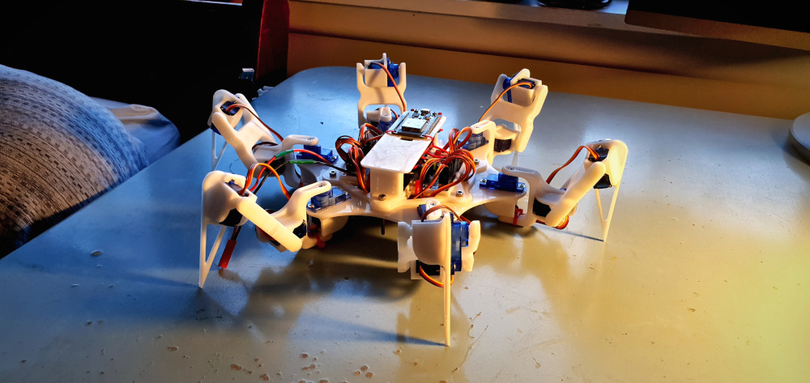

# Mechanical Spider Robot yeet

## Introduction

At the beginning of the year (2021) I watched a <a href="https://www.youtube.com/watch?v=-vVblGlIMgw&ab_channel=AdamSavage%E2%80%99sTested" target="_blank">video</a> online featuring a robotic spider. Immediately I was intrigued and felt the urge to create a similar project of my own. My hope was to design, build and program a robot in such a way as to resemble a the gait or walking behaviour of a biological spider (but with six legs). The project required a diverse set of skills such as 3D modelling, 3D printing, electrical wiring, soldering, and programming.

I decided upon constructing a six legged robot system instead of a full eight legged spider to reduce cost and complexity. The project naturally fell into one of three phases of. The design and prototyping, electrical wiring and programming phases. Design and prototyping was anything to do with the mechanical construction. wiring was anything to do with asking the connections between electrical components. Finally, the programming phase evolved writing coding the methods and logic which the robot movements. Given that my prior experience in embedded system development consisted of basic arduino style; writing code to control and coordinate the movement of 18 servo motors would prove to be an ambitious task.  

## Design and prototyping

The basic construction consists of a body and six legs. The job of the body was to hold all of the power and control electronics. The body also needed to have mounting points for six legs to attach to. Understandably, the legs were used to carry the body and its contents across a physical environment. I used fusion360 to design the leg and body elements.

Each leg component needed to connect one leg component to the next. The servo motor acts a dual purpose as an actuator as well as a hinge for each joint. Some aspects that needed to be considered included the strength, weight as well as dimensions of each component. These things were constrained by the specifications and dimensions of the servo motors.

Within each of the six legs, there are three servo motors to control the three joints. There were 18 servo motors in total. The two joints closest to the body act as a hip joint with deflection allowed in both horizontal and vertical planes. The joint furthest from the body acts as a knee, only allowing deflection in the vertical plane of motion. Finally I designed a body which each leg attaches to as well as housing all of the other electrical components. Most, if not all structural components were 3D printed.

## Electrical components and wiring

There was a small list of different electrical components each of which serving some purpose. At the core of the project is an ESP32 microcontroller whos job is to take in user input from a remote control receiver. Using this data it controls the angle of the 18 servo motors spread across the six legs. Servos use PWM (pulse-width modulation) to control their angular position. A PCA9685 board is a PWM controller board which can broadcast upto 18 independed PWM signals. The servo motors from the left and right respective legs were connected to two of these boards. The PCA9685 uses I2C (I-squard C) as an input which was provided by the ESP32. In order to provide power and control signals to 18 servo motors, electrical components driving the servo motors needed to be provided with an appropriate power source. A battery

12V battery would be connected to several 5V voltage regulators to power the the majority of the on board electrical components.

## Programming phase

The programming phase would finally give life this robot, providing the methods and logic to coordinate walking in response to user control inputs. Programming this robot could almost be considered its own project considering the breadth of functionality that was implemented. The program controlling the robot incudes processing user input, using inverse kinematics to calculate joint angle positions, and coordinating a walking movement pattern governed by the users input.

​        