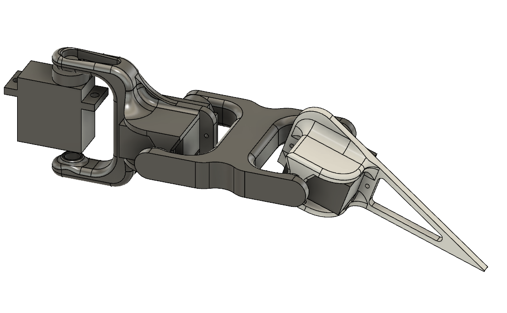
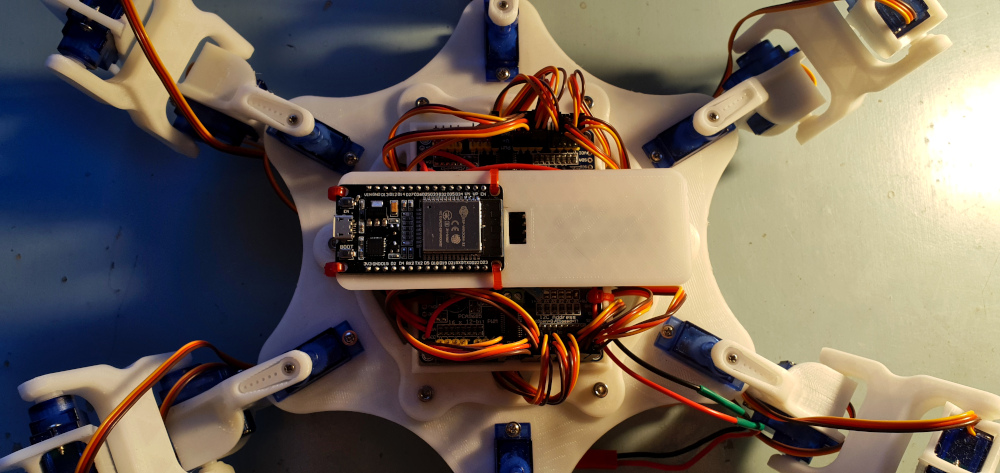

# Mechanical Spider Robot

## Introduction

At the beginning of the year (2021) I watched a <a href="https://www.youtube.com/watch?v=-vVblGlIMgw&ab_channel=AdamSavage%E2%80%99sTested" target="_blank">video</a> online featuring a robotic spider. Immediately I was intrigued and wanted to create a similar project of my own. My hope was to design, build and program a robot in such a way as to resemble a biological spider (but with six legs). The project required a diverse set of skills such as 3D modelling, 3D printing, electrical wiring, soldering, and programming.

I decided upon constructing a six legged robot instead of a full eight legged spider to reduce cost and complexity. The is broken into three phases. The design and prototyping, electrical wiring and programming phases. Design and prototyping was anything to do with the mechanical construction. wiring was anything to do with making the connections between any electrical components. Finally, the programming phase which required taking user input from remote control and using that information to coordinate the robots six legs. Given that my prior experience in this area consisted mostly of simple Arduino style projects, writing code to control and coordinate the movement of 18 servo motors would prove to be an ambitious task.  

## Design and prototyping

Several components make up the mechanical construction for the robot. First is the base structure, as pictured above. The base structure acts as the mounting point for all of the other components including the legs, batteries and other electrical components. Each servo mounting location on the base acts as half of the hinge for the joint with a small cylinder of material mating with the next component in the leg. The servo its self acts as the other half of the hinge.

The legs for the robot use the same method for joint hinges. Lengths for each leg segment roughly resemble the proportions of a biological spider. Although the dimensions are likely not the optimal for walking performance, the joint mobility and range of motion makes up for this. Part of the design process involved estimating the stress on each leg component, this was difficult as the size of the battery and overall weight was unknown at this stage.

Within each of the six legs, there are three servo motors to control the three joints. There were 18 servo motors included in the overall design. The two joints closest to the body act as a hip/ball socket joint with deflection allowed in both horizontal and vertical planes. The joint furthest from the body acts as a knee, only allowing deflection in the vertical plane of motion. All components are 3D printed with STL files available **HERE**. The hardware for mounting the servos comes with the servos, six M3 bolts are used to hold the base components together.

## Electrical components and wiring

There was a small list of different electrical components each of which serving some purpose. At the core of the project is an ESP32 microcontroller whos job is to take in user input from a remote control receiver. Using this data it controls the angle of the 18 servo motors spread across the six legs. Servos use PWM (pulse-width modulation) to control their angular position. A PCA9685 board is a PWM controller board which can broadcast upto 18 independed PWM signals. The servo motors from the left and right respective legs were connected to two of these boards. The PCA9685 uses I2C (I-squard C) as an input which was provided by the ESP32. In order to provide power and control signals to 18 servo motors, electrical components driving the servo motors needed to be provided with an appropriate power source. A battery

12V battery would be connected to several 5V voltage regulators to power the the majority of the on board electrical components.

## Programming phase

The programming phase would finally give life this robot, providing the methods and logic to coordinate walking in response to user control inputs. Programming this robot could almost be considered its own project considering the breadth of functionality that was implemented. The program controlling the robot incudes processing user input, using inverse kinematics to calculate joint angle positions, and coordinating a walking movement pattern governed by the users input.

​        