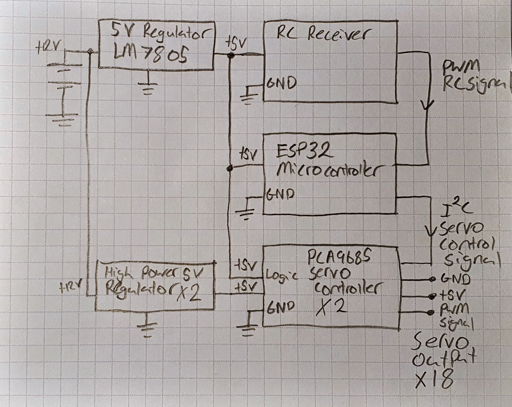

# Mechanical Spider Robot

## Introduction

At the beginning of the year (2021) I watched a <a href="https://www.youtube.com/watch?v=-vVblGlIMgw&ab_channel=AdamSavage%E2%80%99sTested" target="_blank">video</a> online featuring a robotic spider. Immediately I was intrigued and wanted to create a similar project of my own. My hope was to design, build and program a robot in such a way as to resemble a biological spider (but with six legs). The project required a diverse set of skills such as 3D modelling, 3D printing, electrical wiring, soldering, and programming.

I decided upon constructing a six legged robot instead of a full eight legged spider to reduce cost and complexity. The project is broken into three phases. The design and prototyping, electrical wiring, and programming phases. Design and prototyping was anything to do with the mechanical construction. wiring was anything to do with making the connections between any electrical components. Finally, the programming phase which required taking user input from a remote control and using that information to coordinate the robots six legs. Given that my prior experience in this area consisted mostly of simple Arduino style projects, writing code to control and coordinate the movement of 18 servo motors would prove to be an ambitious task.  

## Design and prototyping

Several components make up the mechanical construction for the robot. First is the base structure, as pictured above to the left. The base structure acts as the mounting point for all of the other components including the legs, batteries, and other electrical components. Each servo mounting location on the base acts as half of the hinge for each joint with a small cylinder material mating with the next component in the leg. The servo its self acts as the other half of the hinge.

The legs for the robot use the same method for joint hinges. Lengths for each leg segment roughly resemble the proportions of a biological spider. Although the dimensions are likely not the optimal for walking performance, the joint mobility and range of motion makes up for this. Part of the design process involved estimating the stress on each leg component, this was difficult as the size of the battery and overall weight was unknown at this stage.

Within each of the six legs, there are three servo motors to control the three joints. There were 18 servo motors included in the overall design. The two joints closest to the body act as a hip/ball socket joint with deflection allowed in both horizontal and vertical planes. The joint furthest from the body acts as a knee, only allowing deflection in the vertical plane of motion. The hardware for mounting the servos comes with the servos, six M3 bolts are used to hold the base components together.

## Electrical components and wiring

Controlling 18 separate servo motors from a micro-controller is a logistical task in terms of power and wiring. An open source board called the PCA9685 is a 16-channel PWM controller, this board makes it easy to power and control many devices simultaneously. When powered with 5V and an I2C control signal from the micro controller, it is able to control the angular position of up to 16 servo motors independently. As there are 18 servo motors in the robot, two of these boards were used to control two sets of 9 motors on the left and right sides (3 servos per leg). The I2C signal going to the boards is run in series, with each board set to a separate I2C address. Each PCA9685 board receives power from its own high power switch mode voltage regulator (LM2596) providing 5V at 3A each, this power is used solely to power the servos and not the board logic. The board logic / circuitry on each board is powered by separate a "cleaner" and filtered 5V source from an LM7805 5V linear regulator. The receiver and micro-controller are also powered by this source. Below is a wiring diagram to make it easier to interpret the connections made.

The overall goal of the system is to control the movement of the robots six legs, this requires powering and controlling 18 servo motors. At the core of the robot control system is an ESP32, a 32 bit microcontroller. At a high level, the micro-controllers task is to convert user input into angular positions for the robots 18 servo motors. This turns out to be quite a complicated task as discussed in the programming phase. The features of this microcontroller which contributed to me choosing it are the following.

- I2C support 
- Hardware interrupts
- WI-FI and Bluetooth

There are a variety of ways to get user input to control this robot. I could have used WI-FI or Bluetooth, as the ESP32 micro-controller supports these. However, I decided to use a "hobby grade" remote control receiver and transmitter as I am familiar with working them. This means that in the projects current state, the wireless features of the ESP32 are not made use of. It is then the job of the micro-controller to convert this user input to a set of 18 servo angular positions to control the legs of the robot. 

Hardware interrupts is a way of interrupting the code that is currently running on the micro-controller to run some other function. Since the user input comes in the form of a PWM signal, every time the micro-controller detects a change in the PWM signal, it calls a function which it keeps track of when rising and falling edges of the signal occur. From this, the duty cycle can be calculated and then used to control the robot.

Below is a diagram which shows how the electrical components are connected together.

The battery used to power the robot is a 500 mAH 3-cell 11.1V lithium polymer battery. The voltage is then regulated down to 5V by the 3 voltage regulators for use by the different electrical components. 500 mAH may prove not to be of high enough capacity. It is however, difficult to determine the robots power usage prior to real world testing.

## Programming phase

The programming phase would finally give life this robot, providing the methods and logic to coordinate walking in response to user control inputs. Programming this robot could almost be considered its own project considering the breadth of functionality that was implemented. The program controlling the robot includes processing user input, using inverse kinematics to calculate joint angle positions, and coordinating a walking movement pattern governed by the users input. C++ is being used in conjunction with the Arduino framework and Visual Studio Code's Platform.io plugin to program the robot spider.

This part of the project is under construction and will be documented here when complete.

​        