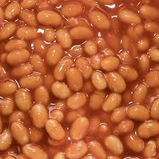

# Bean Soup
<button onclick="location.href='../recipes.html'">Back to Recipes</button>

**Serves 5**

## Ingredients
- 3 Tbsp olive oil
- 1 clove of garlic, peeled and chopped
- 1 onion, diced
- 50-100 g cubed ham or chopped bacon
- 2 small dried chillies, crushed (or 1/2 tsp chilli powder)
- 2 bay leaves
- 1/4 tsp dried thyme
- 400 g can diced tomatoes
- 425 g can red kidney beans
- 440 g can four bean mix
- 4 cups chicken stock
- 1 cup short pasta (macaroni, spirals, etc...)
- 1/2-1 tsp salt
- black pepper to taste
- chopped fresh parskey or basil pesto, and/or parmesan to serve

## Method
1. Heat the oil in a large pot. Add the garlic and onion (plus ham or bacon, if using) and cook, without browning, until the onion is soft and clear. Stir in the crushed chilies, bay leaves and thyme. Cook for one minute longer.

2. Add the canned tomatoes, beans and the stock. Heat until boiling, then add the pasta. Allow to boil gently until the pasta is cooked (usually 10-12 minutes), then add salt and black pepper to taste.

3. Serve topped with some chopped fresh parsley or basil (or a little pesto) and some freshly shaved or grated Parmesan.