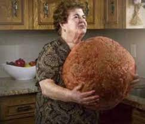

# Mediterranean Meatballs
<button onclick="location.href='../recipes.html'">Back to Recipes</button>

## Ingredients
- 500 grams minced pork
- 1/2 cup chopped fresh herbs
- 1 onion, finely chopped
- 1 slice white bread, crumbled
- 1 egg
- salt and pepper to season
- 2 tblsp oil
- 1/2 cup red wine
- 400g canned tomatoes
- 1 packet of fettuccine pasta or fresh

## Method
1. In a bowl mix together the pork, herbs, onion, bread and egg. Season the mixture well with salt and pepper. Roll the mixture into 24 balls.
2. Heat the oil in a frying pan and cook the meatballs until they are evenly browned all over. Add the red wine and simmer for 5 mins.
3. Stir in the tomatoes. Cover and simmer for 20 mins.
4. Cook the fettuccine. Drain well and toss in a small ammount of olive oil. Divide between four bowls and top with the meatballs.
5. Garnish with cheese and herbs.